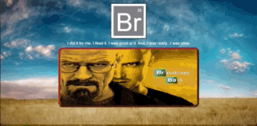

# Actividad 2 - Creación Página Web Corporativa Breaking Bad Fanpage

## Introducción

Este proyecto es una página web para fans de la aclamada serie Breaking Bad. El sitio ofrece información y contenido relacionado con la serie, incluyendo una sección de formulario y una tabla con datos relevantes.

## Objetivos

Con la realización de esta actividad, se pretende asentar los conocimientos de HTML y CSS vistos en la materia de Lenguaje de Marcas y Sistemas de Gestión, con la realización de una página web corporativa.

### Requerimiento 1
La empresa española de marketing y publicidad “QueVeo”, con motivo de la última temporada de Breaking Bad en nuestro país, ha decidido publicitar una aplicación web para sus fans en donde podrán encontrar información de última hora, curiosidades, etc. Para ello presentamos las siguientes soluciones:

- Esta aplicación cuenta con una página principal con el logotipo de la serie;
- Un icono con un texto marcante de la serie;
- El poster cuenta con las medidas 700px x 300px, borde de 10px de grosor y tipo outset, con bordes redondeados;
- Hay una imagen de fondo de pantalla;
- Hay iconos en la pestaña del navegador en todas las páginas;
- Hay interactividad en la página principal, cuando se pincha en la imagen con la palabra 'Breaking' el usuario es llevado a la página 'Formulario';
- Cuando se pincha en la imagen con la palabra 'Bas' el usuario es llevado a la página 'Tabla';

### Requerimiento 2
Introducir la tipografía facilitada para que pueda ser usada en todo el proyecto.
No se puede instalar en el equipo, sino que tenéis que escribir el código necesario en CSS para ello.
Introducir un favicon en la pestaña de cada una de las webs a crear.

**Mira la aplicación online [aquí](https://tanimaraeliassantos.github.io/breakingbadfanpage/).**

## Características

- Página principal con elemento interactivo que lleva usuarios a páginas secundarias
- Página secundaria con formulario para que el usuario pueda participar de un juego temático enviando sus datos a un correo
- Página secundaria con tabla periódica con personajes e imágenes de la serie

## Technologies

- CSS
- HTML

### Autora

[Tanimara Elias Santos](https://github.com/tanimaraeliassantos)

### Versión

1.0.0
 
